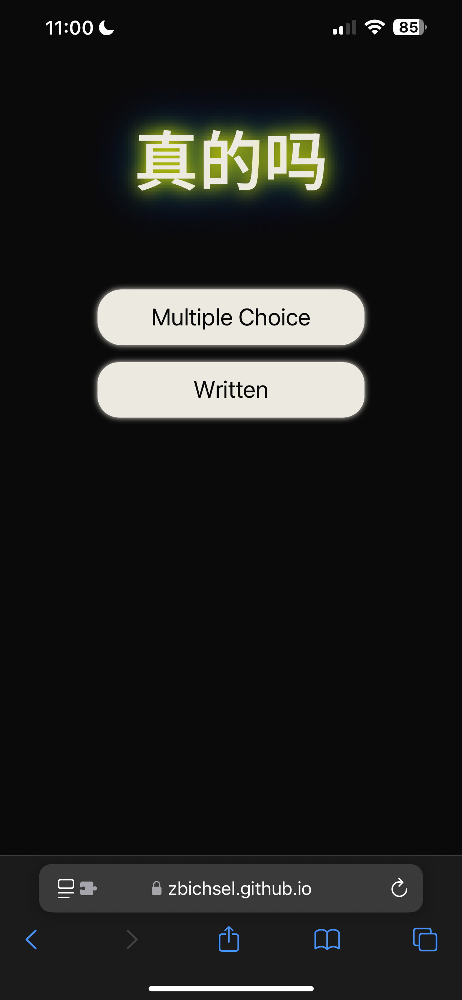
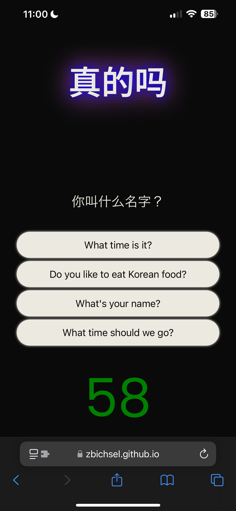
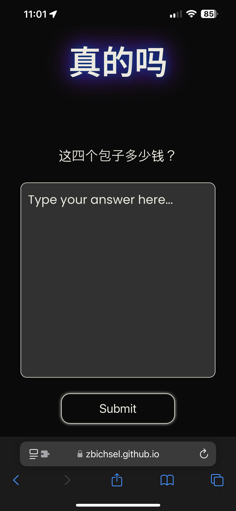

# zhēn de ma || 真的吗

真的吗 is a simple web application wherein the user can test their skills in Mandarin Chinese.

## Installation

This web application requires no installation to use, but if you so wish to download this repository the following steps should be used in your command line

```git clone git@github.com:zbichsel/tech-news-java.git```

Here you can have your own copy of the repository and make any changes to the quiz, whether it's a maths, languages, coding languages, etc. Enjoy!

For live viewing: 

https://zbichsel.github.io/zhendema

## Technology Used


## Preview





## Contributing

Pull requests are welcome. For changes, please open an issue first to discuss what you would like to change.

Email me for questions: biksel09@gmail.com

## License

[](https://opensource.org/licenses/MIT)
